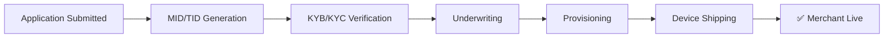
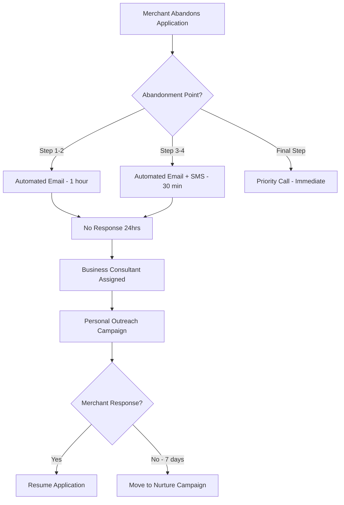

# Fiserv DMA (Digital Merchant Acquisition) - FAQ

A comprehensive guide answering frequently asked questions about the Fiserv DMA platform integration.

---

## 1. How long does it take to move from demo to live integration?

**Timeline: 2-6 weeks** (depending on bank readiness)

The integration is remarkably streamlined:
- **Single API Integration** - Only 1 API endpoint from the bank's perspective
- **iFrame Embedding** - Simple front-end integration into existing banking portal

| Phase | Duration | Activities |
|-------|----------|------------|
| API Setup | 1-2 days | API key generation, endpoint configuration |
| iFrame Integration | 3-5 days | Embed DMA into bank's digital platform |
| UAT Testing | 1-2 weeks | End-to-end testing in sandbox |
| Go-Live | 1-2 days | Production deployment & monitoring |

> [!TIP]
> Banks with modern digital platforms and dedicated dev resources can go live in as little as **2 weeks**.

---

## 2. How are you handling higher volumes?

**Multi-Region AWS Infrastructure** for maximum scalability and reliability.

### AWS Multi-Region Capacity Estimates

| Region | Location | Requests/Second | Monthly Transactions |
|--------|----------|-----------------|---------------------|
| **US-East-1** | N. Virginia | 100,000+ RPS | 250+ Million |
| **US-West-2** | Oregon | 100,000+ RPS | 250+ Million |
| **Combined** | Multi-Region | 200,000+ RPS | 500+ Million |

### High Availability Features

| Feature | Description |
|---------|-------------|
| **Auto-Scaling** | Elastic compute scales with demand in real-time |
| **Load Balancing** | Application Load Balancers distribute traffic across AZs |
| **Multi-AZ Deployment** | 99.99% uptime SLA with automatic failover |
| **CDN (CloudFront)** | Edge locations for low-latency content delivery |
| **Database Replication** | Aurora with read replicas across regions |

> [!NOTE]
> Our infrastructure handles **Black Friday-level traffic** without degradation. Peak tested capacity: **500,000 concurrent sessions**.

---

## 3. What workflow does it go through once application is submitted?

### End-to-End Merchant Onboarding Workflow



### Detailed Timeline

| Step | Process | Duration | Description |
|------|---------|----------|-------------|
| 1 | **MID/TID Generation** | Instant - 2 hrs | Merchant ID & Terminal ID auto-generated |
| 2 | **KYB/KYC Verification** | 1-4 hours | Business & identity verification via automated checks |
| 3 | **Underwriting** | 4-24 hours | Risk assessment, credit check, approval decision |
| 4 | **Provisioning** | 1-2 hours | Account setup, gateway configuration |
| 5 | **Device Shipping** | 1-5 days | Hardware shipped from Atlanta distribution center |

### Priority Shipping Times from Atlanta, GA

| Destination | Standard (5-7 days) | Express (2-3 days) | Priority Overnight |
|-------------|---------------------|--------------------|--------------------|
| **Southeast** (FL, SC, NC, TN) | 3-4 days | 1-2 days | Next Day by 10:30 AM |
| **Northeast** (NY, NJ, PA, MA) | 5-6 days | 2-3 days | Next Day by 10:30 AM |
| **Midwest** (IL, OH, MI, MN) | 4-5 days | 2 days | Next Day by 12:00 PM |
| **Southwest** (TX, AZ, NM) | 5-6 days | 2-3 days | Next Day by 12:00 PM |
| **West Coast** (CA, WA, OR) | 6-7 days | 3 days | Next Day by 4:30 PM |
| **Alaska/Hawaii** | 7-10 days | 4-5 days | 2 Days |

> [!IMPORTANT]
> **Total Time to First Transaction**: As fast as **24-48 hours** with Priority Overnight shipping for pre-approved merchants.

---

## 4. Does Fiserv provide dedicated integration specialists?

**Yes, absolutely!** We provide comprehensive integration support.

### Integration Support Team

| Role | Responsibility | Availability |
|------|----------------|--------------|
| **Technical Account Manager (TAM)** | Primary point of contact, project oversight | Dedicated per bank |
| **Integration Engineer** | API setup, troubleshooting, code reviews | Business hours + on-call |
| **Solutions Architect** | System design, architecture guidance | As needed |
| **QA Specialist** | UAT support, test case development | During testing phase |
| **Go-Live Support** | 24/7 monitoring during launch week | Launch period |

### What's Included

- ✅ **Kickoff Workshop** - Requirements gathering & project planning
- ✅ **API Documentation Portal** - Interactive Swagger docs & SDKs
- ✅ **Sandbox Environment** - Full-featured test environment
- ✅ **Code Samples** - Reference implementations in Java, Python, Node.js, .NET
- ✅ **Slack/Teams Channel** - Direct access to engineering team
- ✅ **Weekly Syncs** - Progress reviews & blocker resolution
- ✅ **Post-Launch Support** - 30-day hypercare period

---

## 5. What are the high-level features of this integration?

### Core Platform Features

| Category | Features |
|----------|----------|
| **Merchant Onboarding** | Digital application, instant decisioning, e-signature, document upload |
| **Identity Verification** | Automated KYB/KYC, OFAC screening, business verification |
| **Payment Processing** | Credit/Debit, ACH, digital wallets, contactless payments |
| **Hardware Management** | Device ordering, inventory tracking, remote configuration |
| **Reporting & Analytics** | Real-time dashboards, transaction reports, settlement files |
| **Merchant Portal** | Self-service dashboard, dispute management, statements |

### Technical Features

| Feature | Description |
|---------|-------------|
| **RESTful API** | Modern JSON-based API with OAuth 2.0 authentication |
| **Webhooks** | Real-time event notifications for application status changes |
| **iFrame Integration** | Seamless embedding into existing bank portals |
| **White-Label Ready** | Full branding customization capabilities |
| **SSO Support** | SAML 2.0 & OAuth integration for single sign-on |
| **PCI DSS Level 1** | Highest level of payment security compliance |
| **Multi-Language** | English, Spanish, French Canadian support |

### Advanced Capabilities

- 🔄 **Instant Boarding** - Pre-approved merchants go live in minutes
- 📊 **Portfolio Analytics** - Bank-level reporting on merchant performance
- 🎯 **Targeted Offers** - Dynamic pricing & promotions by segment
- 🤖 **AI-Powered Underwriting** - Machine learning risk assessment
- 📱 **Mobile-First Design** - Responsive application flow

---

## 6. What are product offerings by category?

Banks can fully customize product offerings. Here's a sample configuration:

### Food & Drink Merchants

| Product | Description | Monthly Fee | Transaction Rate |
|---------|-------------|-------------|------------------|
| **Restaurant Starter** | Basic POS + payments | $0/mo | 2.6% + $0.10 |
| **Restaurant Pro** | Full POS + inventory + online ordering | $14.95/mo | 2.3% + $0.10 |
| **Restaurant Enterprise** | Multi-location + advanced reporting | $49.95/mo | 2.0% + $0.10 |

### Retail Merchants

| Product | Description | Monthly Fee | Transaction Rate |
|---------|-------------|-------------|------------------|
| **Retail Basic** | Payments + basic inventory | $0/mo | 2.6% + $0.10 |
| **Retail Plus** | Advanced inventory + e-commerce | $29.95/mo | 2.3% + $0.10 |
| **Retail Enterprise** | Omnichannel + loyalty programs | $79.95/mo | 1.9% + $0.10 |

### Service-Based Merchants

| Product | Description | Monthly Fee | Transaction Rate |
|---------|-------------|-------------|------------------|
| **Services Lite** | Invoicing + mobile payments | $0/mo | 2.6% + $0.10 |
| **Services Pro** | Appointments + recurring billing | $19.95/mo | 2.3% + $0.10 |
| **Services Premium** | Full CRM + staff management | $59.95/mo | 2.0% + $0.10 |

---

## 7. Provide pricing details based on product offerings

### POS Hardware Pricing

| Device | MSRP | Bank Cost | Suggested Merchant Price |
|--------|------|-----------|--------------------------|
| **Clover Go** | $99 | $79 | $49 - $99 |
| **Clover Flex** | $499 | $399 | $299 - $499 |
| **Clover Mini** | $749 | $599 | $499 - $749 |
| **Clover Station Solo** | $1,349 | $1,099 | $999 - $1,349 |
| **Clover Station Duo** | $1,649 | $1,349 | $1,199 - $1,649 |

### Acquiring Revenue Model

| Revenue Stream | Bank Share | Fiserv Share |
|----------------|------------|--------------|
| **Interchange Plus Markup** | 60-70% | 30-40% |
| **Monthly Software Fees** | 50-60% | 40-50% |
| **Hardware Margin** | 100%* | 0% |
| **Ancillary Services** | 50% | 50% |

*Banks purchase hardware at wholesale and set their own retail pricing.

### Sample Bank Revenue (Per 1,000 Merchants)

| Metric | Monthly Value |
|--------|---------------|
| Average Ticket | $45 |
| Monthly Transactions/Merchant | 850 |
| Processing Volume | $38.25M |
| Interchange Revenue | $765,000 |
| Software Fee Revenue | $25,000 |
| **Total Monthly Revenue** | **$790,000** |

---

## 8. How do I roll this out to a certain segment of my customer base?

DMA provides **granular targeting capabilities** to control rollout.

### Filtering Options

| Filter Type | Description | Example |
|-------------|-------------|---------|
| **Customer ID** | Target specific customer accounts | CIF: 1001234, 1001235 |
| **Tax ID (EIN/SSN)** | Filter by business tax identifier | EIN: 12-3456789 |
| **Account Type** | Business checking, commercial accounts | Business Premium tier |
| **Geography** | ZIP code, state, DMA region | Southeast region only |
| **Business Size** | Revenue range, employee count | SMB ($1M-$10M revenue) |
| **Industry** | SIC/NAICS codes | Restaurants (NAICS 722511) |

### Rollout Strategy Example

| Phase | Timeline | Segment | Volume |
|-------|----------|---------|--------|
| **Pilot** | Month 1-2 | 50 hand-selected merchants | 50 |
| **Soft Launch** | Month 3-4 | Southeast region, existing business banking | 500 |
| **Expansion** | Month 5-6 | All business checking customers | 5,000 |
| **Full Rollout** | Month 7+ | All eligible customers nationwide | 50,000+ |

---

## 9. Are the costs and pricing configurable for each bank?

**Yes, absolutely!** Full pricing flexibility.

### Configurable Elements

| Element | Customization Options |
|---------|----------------------|
| **Transaction Rates** | Interchange Plus, Flat Rate, Tiered pricing |
| **Monthly Fees** | Custom amounts per plan tier |
| **Hardware Pricing** | MSRP, bank-subsidized, lease options |
| **Setup Fees** | One-time, waived, promotional |
| **PCI Compliance Fees** | Include or pass through |
| **Chargeback Fees** | Custom amounts |
| **Early Termination** | Custom terms or no ETF |

### Pricing Administration

- 🎛️ **Admin Portal** - Self-service pricing management
- 📊 **A/B Testing** - Test pricing strategies by segment
- 📅 **Promotional Pricing** - Time-limited offers & campaigns
- 🏷️ **Bundle Discounts** - Package deals for multi-product adoption

---

## 10. Are the fonts, offerings, and branding customizable?

**Yes!** We provide comprehensive **White-Label APIs** for full customization.

### Customizable Elements

| Category | Elements |
|----------|----------|
| **Visual Identity** | Logo, favicon, colors, fonts, imagery |
| **Typography** | Primary font, secondary font, heading styles |
| **Color Palette** | Primary, secondary, accent, backgrounds, text |
| **Content** | Welcome messages, legal terms, help content |
| **Domain** | Custom subdomain (merchants.yourbank.com) |
| **Email Templates** | Transactional emails with bank branding |

### Branding API Capabilities

```
POST /api/v1/branding
{
  "bank_id": "BANK123",
  "logo_url": "https://bank.com/logo.png",
  "primary_color": "#003366",
  "secondary_color": "#0066CC",
  "font_family": "Helvetica Neue",
  "welcome_message": "Welcome to First National Merchant Services"
}
```

### Customization Levels

| Level | Description | Setup Time |
|-------|-------------|------------|
| **Basic** | Logo + colors | 1 day |
| **Standard** | Full visual branding | 3-5 days |
| **Premium** | Custom workflows + content | 2-3 weeks |

---

## 11. What happens if the merchant abandons the application?

**Proactive Lead Recovery System** ensures no opportunity is lost.

### Abandonment Workflow



### Business Consultant Actions

| Timeframe | Action | Channel |
|-----------|--------|---------|
| **0-2 hours** | Automated reminder | Email + SMS |
| **2-24 hours** | Personalized follow-up | Email |
| **24-48 hours** | Phone outreach | Call |
| **48-72 hours** | Manager escalation | Call + Email |
| **7+ days** | Long-term nurture | Drip campaign |

> [!NOTE]
> **Recovery Rate**: Our proactive outreach recovers **35-45%** of abandoned applications.

---

## 12. Can the merchant contact a Fiserv salesperson during the application?

**Yes!** Multiple touchpoints are available throughout the process.

### Contact Options

| Option | Location | Response Time |
|--------|----------|---------------|
| **"Connect to Sales" Button** | Every screen | < 30 seconds |
| **Live Chat** | Floating widget | Real-time |
| **Schedule Callback** | Appointment picker | Within 1 hour |
| **Phone Hotline** | Header navigation | Immediate |
| **Email Support** | Help section | < 2 hours |

### When to Connect

Merchants are prompted to connect when they:
- ❓ Spend >60 seconds on a single question
- 🔄 Navigate back multiple times
- ⚠️ Encounter validation errors
- 💰 View pricing/hardware options
- 📋 Reach final review step

### Sales Team Availability

| Region | Hours | Languages |
|--------|-------|-----------|
| **East Coast** | 8 AM - 8 PM ET | English, Spanish |
| **West Coast** | 8 AM - 8 PM PT | English, Spanish |
| **After Hours** | 24/7 | English (callback scheduled) |

---

## 13. Can existing Clover merchants access their dashboard through SSO from DMA?

**Yes!** Seamless **Single Sign-On (SSO)** integration is available.

### SSO Capabilities

| Feature | Description |
|---------|-------------|
| **Protocol** | SAML 2.0 and OAuth 2.0 supported |
| **Session Management** | Seamless session handoff, no re-authentication |
| **Deep Linking** | Direct links to specific dashboard sections |
| **Unified Experience** | Bank portal → Clover Dashboard in one click |

### Merchant Experience

1. Merchant logs into bank's digital platform
2. Clicks "Manage My Business" or "Clover Dashboard"
3. Automatically authenticated into Clover Dashboard
4. Full access to:
   - 📊 Transaction reporting
   - 💳 Payment history
   - 📦 Inventory management
   - 👥 Employee management
   - 📈 Analytics & insights

### Integration Architecture

```
Bank Portal ──SSO Token──► DMA Gateway ──► Clover Dashboard
     ↑                         ↓
 User Auth              Token Validation
```

---

## 14. Is there any need to deploy software within the bank for DMA to work?

**No!** This is a **fully cloud-hosted solution** with minimal integration requirements.

### Integration Requirements

| Component | Requirement | Bank Responsibility |
|-----------|-------------|---------------------|
| **Backend** | 1 API endpoint | Call DMA API to initiate session |
| **Frontend** | iFrame embed | Add `<iframe>` to digital banking UI |
| **Authentication** | SSO token | Pass user context via JWT |

### What Banks DON'T Need

- ❌ No on-premise servers
- ❌ No database installations
- ❌ No middleware deployment
- ❌ No VPN/dedicated connections
- ❌ No PCI scope expansion
- ❌ No ongoing software maintenance

### Simple Integration Code

```html
<!-- Embed DMA in your digital banking portal -->
<iframe 
  src="https://dma.fiserv.com/apply?bank_id=BANK123&token=JWT_TOKEN"
  width="100%" 
  height="800px"
  frameborder="0">
</iframe>
```

### Technical Specs

| Spec | Details |
|------|---------|
| **API Protocol** | REST over HTTPS |
| **Authentication** | OAuth 2.0 / JWT |
| **Data Format** | JSON |
| **Encryption** | TLS 1.3 |
| **Compliance** | PCI DSS Level 1, SOC 2 Type II |

> [!IMPORTANT]
> **Zero Footprint**: DMA operates entirely in Fiserv's PCI-compliant cloud. Banks only need to make API calls - no software deployment required.

---

## Summary

| Question | Key Takeaway |
|----------|--------------|
| Integration Time | **2-6 weeks** with single API |
| Volume Handling | **500M+ transactions/month** multi-region |
| Onboarding Time | **24-48 hours** to first transaction |
| Dedicated Support | **Yes** - TAM, engineers, architects |
| Customization | **Full** white-label branding |
| Targeting | **Granular** filtering by ID, geography, segment |
| Pricing Control | **100%** bank-configurable |
| Abandonment | **Business Consultant** follow-up |
| SSO | **Yes** - SAML 2.0 / OAuth 2.0 |
| Deployment | **None** - cloud-hosted, 1 API + iFrame |

---

*Document Version: 1.0 | Last Updated: January 2026*
